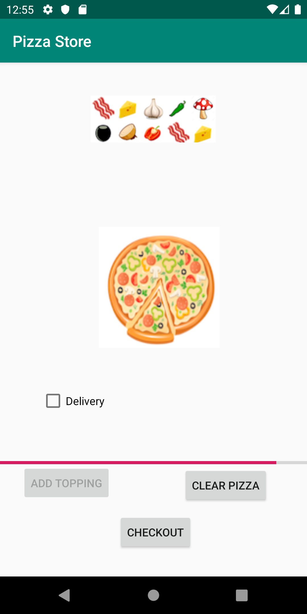

# Pizza-Store-Application
Designed a application to order pizza. Enabled the user to add toppings, delete toppings, choose for home delivery option and clear the pizza of toppings. Allowed the user to check out by calculating the total cost for the pizza. Added visual components dynamically to the activity according to user actions using android flexlayout

